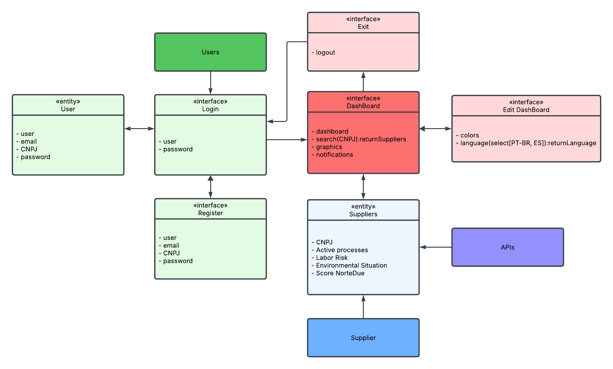

# NorteDue 🌿📊

**Monitoramento e Compliance ESG para Cadeias Produtivas da Amazônia**

  

## 📖 Descrição do Projeto
A **NorteDue** é uma solução B2B desenvolvida para automatizar a diligência prévia (*Due Diligence*) e o monitoramento contínuo de fornecedores. Focada inicialmente nos setores madeireiro, pecuário e extrativista do estado do Acre, a plataforma cruza dados de bases públicas (ambientais, jurídicas e trabalhistas) para mitigar riscos financeiros e de reputação para empresas compradoras. O objetivo é garantir cadeias de suprimentos limpas, livres de passivos ambientais e em conformidade com as exigências globais de ESG.

## 🚀 Principais Funcionalidades
* **Varredura Automatizada:** Consulta via *web scraping* em bases governamentais e tribunais a partir de um único CNPJ/CPF.
* **Relatórios de Risco (Score ESG):** Geração imediata de dossiês categorizando o nível de risco (Alto, Médio, Baixo) do fornecedor.
* **Monitoramento Contínuo:** Alertas em tempo real caso um fornecedor já homologado receba uma nova autuação ambiental ou processo judicial.
* **Dashboard Intuitivo:** Interface visual e acessível focada na experiência do gestor de compras e suprimentos.

## 💻 Tecnologias Utilizadas
O ecossistema do projeto foi estruturado para garantir escalabilidade e eficiência no processamento de dados:
* **Backend & Automação de Dados:** Python (Web Scraping, Processamento de Dados, APIs)
* **Frontend:** JavaScript, HTML5, CSS3 (Responsividade e Interatividade em tempo real)
* **Design Pattern:** Arquitetura SaaS voltada para rápida implementação empresarial.
